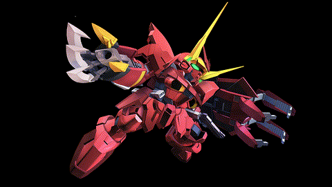

# Raspberry Pi Image Slideshow 🦀

A Rust application that displays PNG images in a slideshow with random animated transitions directly to HDMI monitors on Raspberry Pi 4 without requiring X11 or GUI frameworks.

## ✨ Features

- **Direct Framebuffer Access**: Renders to `/dev/fb0` for hardware-accelerated graphics
- **17 Transition Effects**: Animated transitions between images (fade, slide, wipe, dissolve, etc.)
- **Cross-Compilation Ready**: Build ARM64 binaries from any development platform
- **No Dependencies**: Runs on minimal Raspberry Pi OS installations without X11
- **File System Watching**: Automatically detects new PNG images added to the directory
- **Configurable Timing**: Command line options for display duration and transition speed
- **Graceful Exit**: Shows random jokes when interrupted

## Example



## 🎯 Transition Effects

The slideshow features 17 different transition animations:

- **Basic**: Fade, Dissolve
- **Slide**: Left, Right, Up, Down
- **Wipe**: Left, Right, Up, Down, Circular, Diagonal
- **Effects**: Morph, Pixelate
- **Easing**: Bounce, Elastic, Ease-In, Ease-Out, Ease-In-Out, Accelerated

## 🚀 Quick Start

### Prerequisites

```bash
# Install Rust and cross-compilation target
curl --proto '=https' --tlsv1.2 -sSf https://sh.rustup.rs | sh
rustup target add aarch64-unknown-linux-musl

# Install cross-compilation tools (Ubuntu/Debian)
sudo apt install gcc-aarch64-linux-gnu

# Or on macOS with Homebrew
brew tap messense/macos-cross-toolchains
brew install aarch64-unknown-linux-musl
```

### Build and Deploy

```bash
# Clone and cross-compile
git clone https://github.com/imcmurray/pi-slideshow-rs
cd pi-slideshow-rs
chmod +x build.sh
./build.sh

# Copy to Raspberry Pi
scp target/aarch64-unknown-linux-musl/release/pi-slideshow-rs pi@raspberrypi.local:~/

# Run on Pi (may need sudo for framebuffer access)
ssh pi@raspberrypi.local
sudo ./pi-slideshow-rs
```

Make sure you change your pi username if needed and raspberrypi.local to match your setup.

### Local Development

```bash
# Build and test locally (creates framebuffer_output.raw file)
cargo build

# Add some PNG images to the directory, then run
cargo run

# View output file with image viewer or hex editor  
# File contains raw BGRA pixel data at 1920x1080
```

## ⚙️ Command Line Usage

```bash
# Show help
./pi-slideshow-rs --help

# Basic usage with defaults (30s display, 1.5s transitions)
./pi-slideshow-rs

# Custom timing and directory
./pi-slideshow-rs --image-dir /path/to/images --delay 15 --transition 800

# Quick slideshow for testing
./pi-slideshow-rs --delay 5 --transition 300
```

### Command Line Options

| Option | Short | Description | Default |
|--------|-------|-------------|---------|
| `--image-dir` | `-i` | Directory containing PNG images | `.` (current directory) |
| `--delay` | `-d` | Display duration per image (seconds) | `30` |
| `--transition` | `-t` | Transition duration (milliseconds) | `1500` |
| `--framebuffer` | `-f` | Framebuffer device path | `/dev/fb0` |

## 🛠️ Technical Architecture

### Core Components

- **Framebuffer**: Custom framebuffer abstraction handling BGRA pixel format
- **Image Manager**: PNG loading, scaling, and caching system
- **Transition Engine**: Real-time generation of 17 different transition effects
- **File Watcher**: Automatic detection of new images added to directory
- **Cross-Platform Support**: Fallback to file output when `/dev/fb0` unavailable

### Performance Specifications

- **Resolution**: 1920x1080 (Full HD)
- **Frame Rate**: ~30 FPS during transitions
- **Pixel Format**: 32-bit BGRA for framebuffer compatibility
- **Memory Usage**: Direct framebuffer mapping for efficient rendering
- **Transition Quality**: Real-time mathematical calculations for smooth effects

## 📁 Project Structure

```
pi-slideshow-rs/
├── Cargo.toml           # Dependencies: image, clap, notify, memmap2, etc.
├── build.sh             # Cross-compilation script
├── src/main.rs          # Main slideshow application with transition effects
├── CLAUDE.md            # AI assistant context and instructions
└── README.md            # This file
```

### Adding New Transition Effects

Add custom transitions to the `TransitionType` enum and implement in `create_transition_frame()`:

```rust
fn my_custom_transition(
    &self,
    img1: &RgbaImage,
    img2: &RgbaImage, 
    progress: f32,
    result: &mut RgbaImage,
) {
    // Your custom transition logic here
    // progress goes from 0.0 to 1.0
    for y in 0..img1.height() {
        for x in 0..img1.width() {
            // Blend pixels based on your algorithm
        }
    }
}
```

### Hardware Integration Examples

- **GPIO Control**: Add `rppal` crate for LED strips or sensors
- **Camera Input**: Add `v4l` crate for live camera feeds
- **Audio Reactive**: Add `alsa` crate for music-synchronized transitions
- **IoT Integration**: Add `tokio` for network-connected displays

## 🔍 Use Cases

Perfect for:

- **Digital Photo Frames**: Personal or professional image displays
- **Art Galleries**: Museum exhibitions with smooth transitions
- **Digital Signage**: Business displays with automatic image rotation
- **Event Displays**: Weddings, parties, conferences with live photo feeds
- **Kiosks**: Information displays with visual content
- **Ambient Displays**: Decorative screens with rotating artwork

## 🐛 Troubleshooting

### Build Issues
- **Missing target**: Run `rustup target add aarch64-unknown-linux-musl`
- **Linker errors**: Install `gcc-aarch64-linux-gnu` package
- **Permission denied**: Run `chmod +x build.sh`

### Runtime Issues
- **No display**: Verify HDMI connection and configuration
- **Permission denied**: Run with `sudo` for framebuffer access
- **Poor performance**: Reduce transition duration or image resolution
- **No images found**: Ensure PNG files exist in the specified directory

### Raspberry Pi Setup
- **Enable HDMI**: Add `hdmi_force_hotplug=1` to `/boot/config.txt`
- **Set resolution**: Configure `hdmi_mode=16` for 1920x1080
- **Disable blanking**: Add screen timeout disable commands to `/etc/rc.local`

## 📚 Resources

- [Rust Cross-Compilation Guide](https://rust-lang.github.io/rustup/cross-compilation.html)
- [Linux Framebuffer Documentation](https://www.kernel.org/doc/Documentation/fb/framebuffer.txt)
- [Raspberry Pi Configuration](https://www.raspberrypi.org/documentation/configuration/)

## 📄 License

MIT License - See LICENSE file for details

## 🤝 Contributing

Contributions welcome! Please read CONTRIBUTING.md for guidelines.

---

🎨 **Start displaying beautiful images on your Raspberry Pi!** 🦀